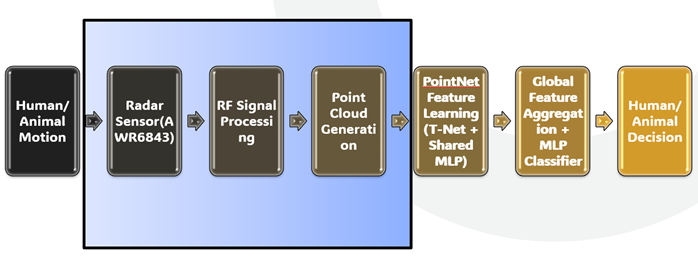
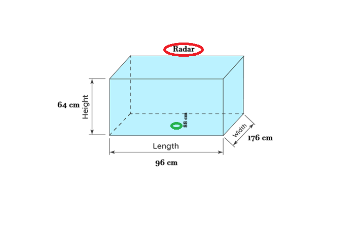
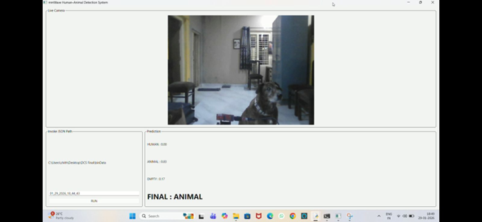

---

# mmWave Human–Animal Detection using PointNet

Edge-deployable mmWave radar-based human–animal classification system using PointNet with Input T-Net.

---

## 📌 Project Overview

This project implements a deep-learning-based classification system using **Texas Instruments mmWave Radar** for detecting:

* Human presence
* Animal movement
* Empty environment

The system:

* Processes radar point cloud data
* Performs temporal windowing
* Applies fixed-N normalization
* Trains a PointNet-based classifier
* Supports real-time inference
* Integrates with a live GUI interface

Designed for low-light, privacy-safe, edge deployment scenarios.

---

## 📡 Radar Platform

Hardware: Texas Instruments mmWave Radar
Toolchain: TI Industrial Visualizer

Extracted Features:

* X coordinate
* Y coordinate
* Z coordinate
* Velocity
* SNR

Radar enables robust detection independent of lighting conditions.

---

## 🧠 System Flow

Below is the complete processing pipeline:



Flow:

Target
→ mmWave Radar
→ TI Industrial Visualizer
→ Replay JSON
→ Windowing
→ Fixed-N Preparation
→ PointNet + Input T-Net
→ Classification Output

---

## 🧪 Experimental Setup

Testing environment and radar placement:



Setup Details:

* Indoor controlled environment
* Fixed radar mounting
* Defined detection region
* Window size: 10 frames
* Fixed-N sampling: 256 points

---

## 🏗 Project Structure

```
mmWave-Human-Animal-Detection/
│
├── configs/
│   ├── demo.bin
│   └── people_tracking_config.cfg
│
├── preprocessing/
│   ├── windowing.py
│   └── fixed_n_prepare.py
│
├── models/
│   ├── pointnet.py
│   └── t_net.py
│
├── training/
│   └── final_train_pointnet.py
│
├── inference/
│   └── realtime_pointnet_inference.py
│
├── gui/
│   └── main_gui.py
│
├── results/
│   └── Classification.png
│
├── setup/
│   ├── block_diagram.png
│   └── experimental_setup.png
│
├── requirements.txt
└── README.md
```

---

## 🔄 Data Pipeline

### 1️⃣ Windowing

Converts replay JSON files into 10-frame sliding windows.

```
python preprocessing/windowing.py
```

---

### 2️⃣ Fixed-N Preparation

Converts each window into fixed shape:

```
(256, 5)
```

Sampling logic:

* >256 points → random sampling
* <256 points → zero padding
* 0 points → zero matrix

```
python preprocessing/fixed_n_prepare.py
```

---

## 🏋️ Training

Install dependencies:

```
pip install -r requirements.txt
```

Run training:

```
python training/final_train_pointnet.py
```

Training Configuration:

* Batch size: 16
* Learning rate: 1e-3
* Max epochs: 50
* Early stopping: Patience = 5
* Optimizer: Adam
* Loss: CrossEntropy

Model output:

```
final_pointnet_tnet.pth
```

---

## 🎯 Real-Time Inference

Run inference:

```
python inference/realtime_pointnet_inference.py
```

Features:

* Sliding window classification
* Temporal guard logic
* Confidence-aware decision refinement
* Continuous monitoring

---

## 🖥 GUI Interface

Launch interface:

```
python gui/main_gui.py
```

Features:

* Live camera feed
* Real-time probability display
* Final decision output
* TI Industrial Visualizer integration

---

## 📊 Results

Below is the classification performance:



Metrics evaluated:

* Accuracy
* Confusion Matrix
* Precision
* Recall
* F1-score

---

## 📦 Requirements

* torch
* numpy
* scikit-learn
* PySide6
* opencv-python

Install using:

```
pip install -r requirements.txt
```

---

## 📌 Notes

* Dataset is not included in this repository.
* Trained model weights (`.pth`) are not included.
* Requires TI mmWave Radar hardware and Industrial Visualizer.
* Designed for research and experimental deployment.


